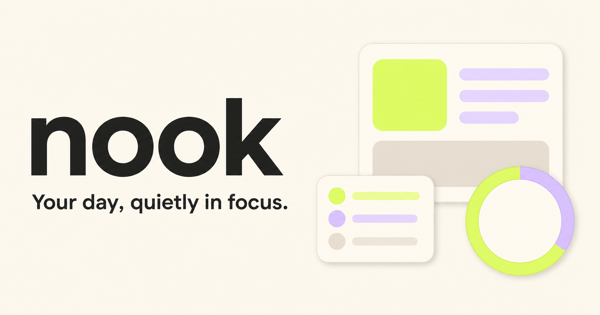

# Nook

> Your day, quietly in focus.

Nook v2 Wave 1 is a calm, local-first daily operating system for planning,
habits, deep-focus sessions, and private dated notes. It works without an
account, cloud database, or tracking and keeps personal data in the current
browser. The complete interface is available in English and Vietnamese, with
English as the default.



## Nook Arc

Nook connects its tools into one daily loop:

**Open → Shape → Focus → Tend → Close → Weekly Compass**

Home stays a concise launchpad for that loop. Primary navigation preserves the
fixed order **Today – Habits – Home – Focus – Notes**, with Home centered.

## Wave 1 highlights

- **Today:** daily capacity, quick capture, categories and estimates, one
  Anchor plus Support and Optional lanes, completion, deletion, and focus
  handoff.
- **Habits:** minimum versions, daily check-ins, habit capture, and a factual
  seven-day rhythm without streak pressure.
- **Home:** Morning Plan, Close Day, Day Arc, and a context-aware next quiet
  move.
- **Focus:** timestamp-based 15/25/50/90-minute timer, intention, distraction
  pad, session note, and real seven-day completed-session history.
- **Notes:** one Markdown-friendly note per date, date navigation, archive,
  search, and autosave on this device.
- New users see a short branded launch followed by a skippable three-step
  introduction. Language is chosen first; completing the flow opens Morning
  Plan, and Settings can replay it without changing current data.
- Light and dark themes, accessible dialogs and keyboard navigation, responsive
  mobile and desktop layouts, `Ctrl/⌘ + K` quick actions, and an offline
  production app shell after the first visit.
- Direction-aware tab transitions follow the fixed navigation order. Launch,
  onboarding, and tab motion reduce to brief fades when reduced motion is set.

## Premium Preview

This repository is an **owner-preview build**. It exposes functional, locally
computed Premium Preview modules so the product can be evaluated before
commerce is introduced:

- Local Replan for capacity overflow
- Routine Designer for habit minimums
- Named Focus Profiles (15, 25, 50, and 90 minutes)
- Weekly Compass after at least three days of real recorded activity
- Local note templates for morning, closing, and weekly reflection

There is no billing, paywall, account entitlement, or owner authentication in
Wave 1; “owner preview” is a development/product state, not an access-control
boundary. Future commercial releases are intended to support **monthly,
yearly, and lifetime** options, but no price, checkout, subscription, receipt,
restore-purchase, or app-store billing behavior exists yet.

## Getting started

Requirements: Node.js 22.13 or newer (with npm).

```bash
npm ci
npm run dev
```

Open `http://localhost:3000`.

A fresh local profile starts in English and offers English or Tiếng Việt in
onboarding. The introduction can be skipped. Existing v1 migrations and older
v2 snapshots are not forced through onboarding.

## Quality checks

```bash
npm run test
npm run lint
npm run typecheck
npm run build
```

Run the complete verification pipeline with:

```bash
npm run check
```

`check` runs linting, TypeScript checks, the schema/migration test suite, and a
production build in that order. The tests cover deterministic v2 defaults,
local date helpers, timestamp-based timer behavior, derived metrics, versioned
backup round trips, safe v1/v2 compatibility for language and onboarding, and
malformed-backup rejection.

## Local data, migration, and backup

The current snapshot is stored under `nook.local.v2` in browser storage. It
contains tasks, habits and dated check-ins, daily records, completed focus
sessions, current timer state, dated notes, selection, theme, language, and
onboarding completion.

When v2 data is absent, Nook reads the legacy `nook.local.v1` shape and safely
normalizes it into schema v2. Existing task, habit, note, timer, and preference
values are preserved; undated v1 totals remain marked as legacy instead of
being expanded into invented daily history. Legacy users default to English
and are marked as already onboarded, so the introduction is never replayed
automatically.

Export creates a validated, versioned `nook-backup` JSON file. Import validates
and confirms before replacement. Confirmed imports and local resets first save a
recovery copy under `nook.rollback.v2` and expose a short-lived undo, but an
exported JSON file is the durable backup to keep before clearing browser data or
moving devices. Nothing is uploaded.

## Privacy model

Nook has no application account, analytics, telemetry, remote API, or automatic
cloud synchronization. All core features and Premium Preview calculations use
local records. Backup and data ownership remain part of the free foundation.

## Production

```bash
npm run check
npm run deploy:vinext
```

Set `SITE_ORIGIN` to the app's absolute public URL in the deployment environment
(for example, `https://nook.example.com`). Nook uses it to emit correct Open
Graph and Twitter image URLs. Local development does not require this variable.
The deploy command builds and publishes the Worker using `wrangler.jsonc`.

## Stack

React 19, TypeScript, Vinext, Vite, Tailwind CSS, Cloudflare Workers, and the
browser Storage and Service Worker APIs. Interface icons are provided by
Phosphor Icons.

## Product documentation

- [Product specification](PRODUCT.md)
- [Design direction](DESIGN.md)

## License

MIT — see [LICENSE](LICENSE).
